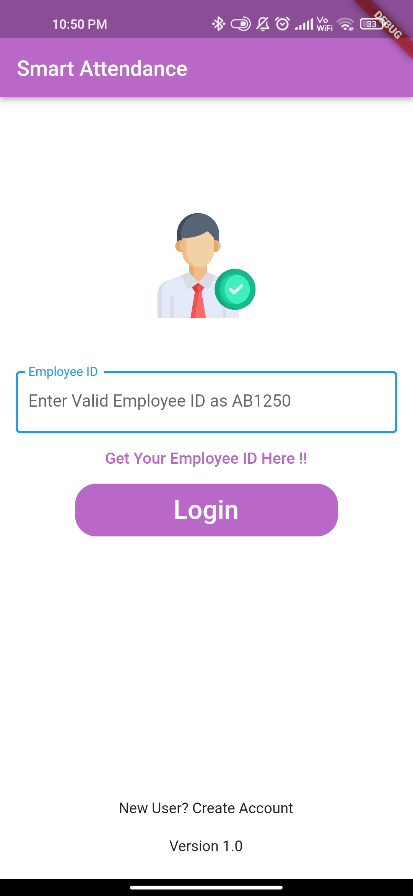
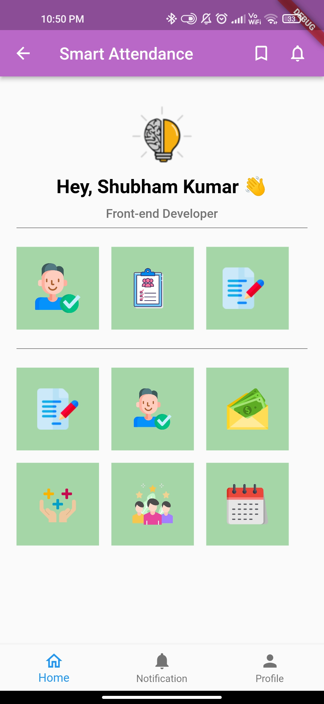
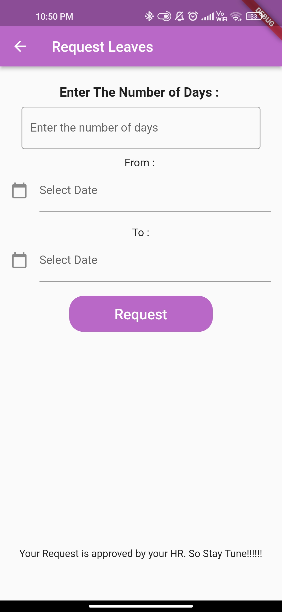

# smart_attendance

WCS Hackathon Project

# Project Name : SMART ATTENDANCE SYSTEM

# Team Name : PerBit 2022

# Team Member 
- Shubham Kumar
- Shivam Thakur
- Harsh Pal
- Gauri Sharma

# Problem Statement 

It is required to develop a smart attendance capturing mobile app with following
features: 1. It should capture basic details of employees like Photograph
(headshot), Name, Designation, Employee Number, Gender, Office Address, etc.
2. It should recognize the employee by face while capturing the attendance
(entry) through face recognition and enter the relevant details including entry
time in the system after successful face recognition. Similarly, while exiting the
office premises, employee will be recognized using his/her face and exit time
will be entered in the system. 3. The app should automatically capture the GPS
location where the attendance is being taken and allow capturing the
attendance only in a geo-fenced area (100 meters within LATITUDE/LONGITUDE)
the office premises. Otherwise, the app should automatically exit. 4. The app
should successfully work for any specific employees with or without wearing
spectacles, cap or industrial helmet.

# Solution 

After the market research, we are conclude that :
1. Our customers are mainly corporate offices, companies and colleges.
2. There is almost no solution available for this problem but if any present then
we are different from them that we provide a location system for our project.
3. This project is a software then we can sell this software with different
companies and offices.

# Application Use :

These are following Step to check our Application : 
- These is Bulid Folder in our repo.
- In this Bulid these is app.apk file by the help of this file you can just simply intsall it.
- Use Code SK720 for login 
- After You will get a proper idea of our application

# Screenshot

